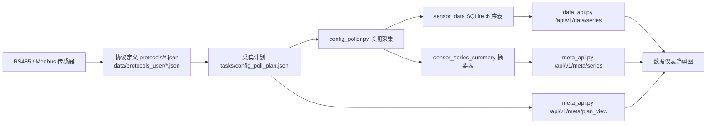

# HydroCore 3.1 系统定位与数据仪表分析

日期：2026-07-05

## 1. 先给结论

HydroCore 3.1 不应该被理解成一个普通 Web 后台，也不应该被理解成一个单纯的水质曲线看板。

它更接近一台运行在树莓派上的循环水处理边缘控制器：

1. 下位机通过 RS485 / Modbus 接入传感器。
2. 上位机后端负责协议解释、采集计划、串口互斥、数据落库、动作调度。
3. 前端是现场 HMI，用来让人看懂系统状态、完成配置、判断自动控制是否可信。

因此，“数据仪表”的核心不是把曲线画出来，而是回答：

- 采集是否还在运行？
- 数据是否新鲜？
- 哪些传感器/参数可信，哪些无数据、过期或异常？
- 当前值是什么，趋势是否值得进一步查看？
- 如果后面任务计划要引用某个参数，这个参数的身份和数据质量是否清楚？

## 2. 外部依据

NIST SP 800-82 Rev. 3 对 OT 的描述强调，这类系统会监测或直接改变物理环境，并且需要兼顾性能、可靠性和安全性。HydroCore 控制泵、阀、PWM 输出，符合这个定义，所以不能按普通信息系统的交互标准处理。

ISA-101 针对过程自动化 HMI 的公开说明强调，HMI 设计目标包括减少操作错误、提升态势感知、可靠性和运行连续性。HydroCore 的 10 寸本地屏幕应该优先服务这些目标，而不是追求视觉效果或后台管理式密集表单。

Modbus 官方资料把 Modbus 定义为应用层协议，并说明其功能码用于事务读写。对 HydroCore 来说，这意味着协议 JSON、地址、寄存器字段、数据类型和字节序是下位机事实的一部分，前端不能随意重新解释。

参考：

- NIST SP 800-82 Rev. 3: https://csrc.nist.gov/pubs/sp/800/82/r3/final
- ISA-101 Series of Standards: https://www.isa.org/standards-and-publications/isa-standards/isa-101-standards
- Modbus Specifications: https://www.modbus.org/modbus-specifications

## 3. 商业与现场定位

这个产品卖的不是“图表”，而是一个低成本、可本地交付、能在无公网状态下运行的循环水现场控制能力。

典型购买者：

- 水处理工程商或系统集成商：要低成本可交付设备。
- 物业、工厂或楼宇运维：要少巡检、少事故、少误操作。
- 小型循环水系统负责人：要基础监测、加药、排水和记录。

典型使用者：

- 调试人员：接线、扫地址、验证传感器和继电器。
- 运维人员：看设备是否正常、自动计划有没有运行。
- 水处理技术人员：看 pH、电导率等参数变化，调整阈值和动作。
- 维护人员：查历史、查日志、定位串口或传感器故障。

这几类人不关心 `protocol/address/parameter` 这些字段本身，但系统内部必须保留这些事实，才能追溯、诊断和避免误控。

## 4. 当前系统真实链路

当前项目的核心链路如下：

关键事实：

- 设备定义文件支持内置库和用户库，用户库同名覆盖内置库。
- `config_poll_plan.json` 是当前采集参数的直接事实源。
- `plan_view` 应该把协议、地址、参数、标签、单位整理成前端可用的视图。
- `sensor_data` 只存事实数据：时间、协议、地址、参数、值。
- `sensor_series_summary` 是性能优化后的派生摘要，用于快速知道每条序列的数据范围。

当前树莓派运行状态验证：

- `/api/v1/poller/status` 返回 `enabled=true`、`running=true`。
- `/api/v1/meta/plan_view` 返回 3 个采集对象。
- `/api/v1/meta/series` 返回 12 条序列，来源为 `summary`。
- `plan_view` 已能把 `电阻率` 的单位补为 `Ω·cm`，把 `盐度` 的单位补为 `mg/L`。

## 5. 原设计中正确的部分

### 5.1 模块解耦方向是对的

协议定义、采集计划、采集器、数据库、数据 API、动作配置、任务计划分层是正确方向。它看起来老派，但对工业边缘设备是好事。

可靠性来自几个边界：

- 协议 JSON 只描述传感器寄存器和字段。
- 采集计划只描述采什么、多久采、多久存。
- 数据库只存事实，不掺 UI 解释。
- 动作配置只描述输出设备和动作模板。
- 任务计划只描述什么时候、因为什么调用动作。

### 5.2 串口权威中心是必要的

`poller_guard.py` 把 poller 定义为唯一合法长期串口持有者，扫描、读配置、写配置必须避让。这是工业系统里非常重要的治理点。

前端应把它表达成人话：

- 当前正在采集，不能同时扫描设备。
- 如需修改传感器配置，请先暂停采集。

而不是暴露 PortBusy、thread、lock 之类后端词。

### 5.3 本地运行路线是正确的

这个设备必须能在无公网或局域网临时访问下运行。SQLite、本地 JSON、本地调度、本地日志的路线是合理的。

## 6. 当前主要问题

### 6.1 数据仪表仍然偏“趋势工具”，不够像现场值守屏

当前页面已经能显示指标、当前值、24h 变化、趋势图和采集新鲜度，但现场用户第一眼仍难以回答：

- 这台设备整体正常吗？
- 哪个传感器离线了？
- 哪条数据过期了？
- 哪些参数只是事件量，不适合看 24h 趋势？
- 为什么这个参数能被任务计划引用？

也就是说，趋势图有了，但“数据可信度”和“采集健康”还没有成为第一层信息。

### 6.2 前端还保留了不应存在的猜测逻辑

`ui/lab/js/dashboard.js` 中仍有 `unitOf()`、`parseKey()` 这类历史兜底逻辑，会根据字段名猜单位和短标签。

在工业控制系统里，这只能作为最末级兜底，不能作为主要显示依据。

正确优先级应是：

1. `config_poll_plan.json` 中的参数 label/unit。
2. 对应协议 JSON 的 `label_zh`/`unit`。
3. 后端生成的完整参数身份。
4. 最后才是前端兜底显示原始字段名。

### 6.3 “完整参数身份”没有被产品化

用户说的 “PH-地址9” 是对的。任务计划里选择参数时，不应该让用户分别选协议、地址、字段。

应该由后端给出完整候选项，例如：

- `pH @ 地址9`
- `温度 @ PH传感器 地址9`
- `电导率 @ 地址10`
- `腐蚀率 @ 地址8`

选择后内部再带上：

- protocol
- address
- parameter
- label
- unit
- port
- event_only
- agg_mode

这既保留工业追溯性，又减少用户认知负担。

### 6.4 事件量和连续量没有被区分表达

例如 `warning` 是 `event_only=nonzero_or_change`，它不应该和 pH、电导率、温度一样默认显示 24h 趋势变化。

数据仪表需要区分：

- 连续测量值：适合当前值、趋势、均值、最大最小。
- 事件/状态量：适合显示最近状态、最近发生时间、次数。
- 配置/校准量：通常不该出现在普通数据仪表主列表。

这些类型不应该靠前端固定分类，而应该由采集计划或协议元数据传递。

### 6.5 变化值表达有显示和语义问题

当前可见问题：

- `电位` 出现 `+70.785 (+-92.39%)`，符号组合错误。
- 某些参数跨越 0 或基准值接近 0 时，百分比变化不一定有业务意义。
- 对 pH、电位、偏移量这类参数，简单显示百分比变化可能误导现场人员。

数据仪表应支持按参数定义是否显示百分比变化，或至少在基准接近 0、符号跨越时隐藏百分比。

### 6.6 10 寸屏下空间分配仍不合理

1024x600 近似视口下，页面可用但控制区高度接近 167px，趋势图剩余高度约 381px。

问题不是前端框架限制，而是信息优先级仍未按 10 寸 HMI 重排：

- 顶部控制过多。
- 左侧列表占用空间像行情软件。
- 状态信息没有形成稳定的“健康摘要”。

## 7. 数据仪表应该重新定义为两个层级

### 7.1 第一层：现场值守

第一层不是图，而是状态。

建议默认第一屏回答：

- 采集状态：采集中 / 已暂停 / 异常。
- 最新数据：几秒前、几分钟前、是否过期。
- 传感器对象：地址、协议、参数数、最新成功时间。
- 参数状态：正常、有数据但过期、无数据、事件量、错误。

左侧不应只是指标列表，而应更像“参数状态清单”：

- 名称：`电导率 @10`
- 当前值：`2.346 mS/cm`
- 数据状态：`新鲜 / 过期 / 无数据 / 事件`
- 最近更新：`6秒前`
- 24h 变化：仅在适合时显示

### 7.2 第二层：趋势诊断

当用户点某个参数后，右侧进入趋势诊断：

- 最近 / 回放
- 间隔
- 统计方式
- 趋势图
- 数据缺口
- 导出

趋势诊断是为了分析，不是为了证明系统还活着。系统是否还活着必须由状态层明确告诉用户。

## 8. 数据仪表和其他模块的边界

数据仪表负责：

- 展示采集状态。
- 展示参数当前值、历史趋势、数据新鲜度。
- 暴露数据质量问题。
- 为任务计划提供“参数可被引用”的信任基础。

数据仪表不负责：

- 编辑协议 JSON。
- 修改采集计划。
- 设置 GPIO。
- 设置任务计划。
- 发起真实动作。

如果需要跳转，也应是明确跳转：

- 传感器无数据 -> 去“硬件配置 / 数据采集”检查。
- 参数标签或单位不对 -> 去“硬件配置 / 设备定义库”处理。
- 想按参数触发加药 -> 去“任务计划”新建条件计划。

## 9. 后续改造优先级

### P0：守住事实链路

- 前端不再新增硬编码分类和硬编码单位。
- 参数选择统一使用后端 `plan_view` 输出。
- 任务计划条件参数改为选择完整参数，不再让用户拆选协议/地址/字段。

### P1：补齐数据可信度表达

- `meta/series` 或新接口返回每条序列的最新时间、数据年龄、是否过期。
- 前端按参数显示 `新鲜 / 过期 / 无数据 / 事件量`。
- 顶部显示整体采集健康，而不是只显示“采集中”。

### P2：重排 10 寸屏信息架构

- 左侧从行情 ticker 改为状态清单。
- 顶部控制收缩为两行以内。
- 图表区域优先保留稳定尺寸。
- 手机只做应急查看和少量操作，不承载完整分析。

### P3：修正趋势表达

- 修复 `+-92.39%` 这类格式问题。
- 参数可配置是否显示百分比变化。
- 事件量不显示普通 24h 趋势变化。
- 数据缺口在图上可见，避免误以为连续正常。

### P4：生产运行治理

- 正式运行不应依赖 Flask debug server。
- poller、Web 服务、任务调度应进入 systemd 或等价服务管理。
- 开机安全状态、日志轮转、数据库备份、采集异常告警需要形成运维规范。

## 10. 最终判断

HydroCore 的设计方向没有错，甚至底层分层比看起来更适合工业边缘设备。

现在的问题不是“缺一个更漂亮的页面”，而是前端还没有完全承担 HMI 的职责：

> 让现场人员在有限屏幕上快速判断系统是否可信，并能从可信状态进入趋势、配置和控制。

所以接下来针对“数据仪表”的改造，不应从视觉风格开始，而应从产品职责开始：

1. 先把采集健康和数据可信度放到第一层。
2. 再把参数身份和来源链路表达清楚。
3. 最后才优化图表、布局和视觉密度。

